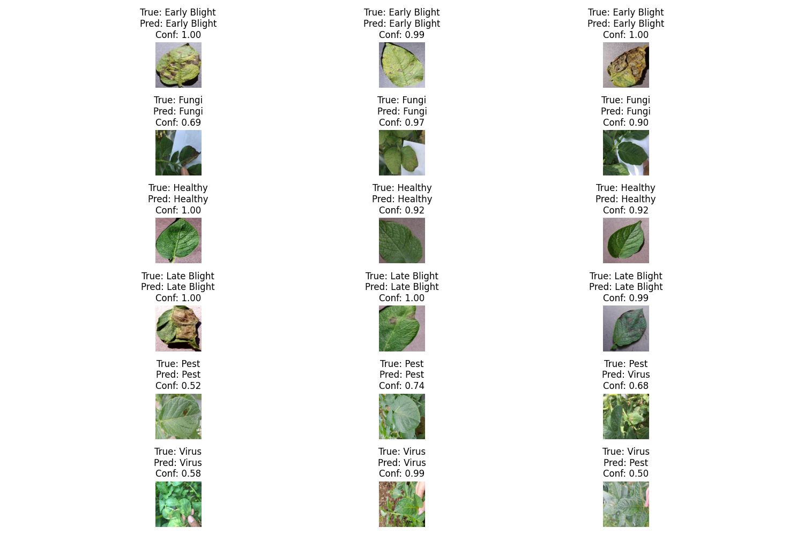
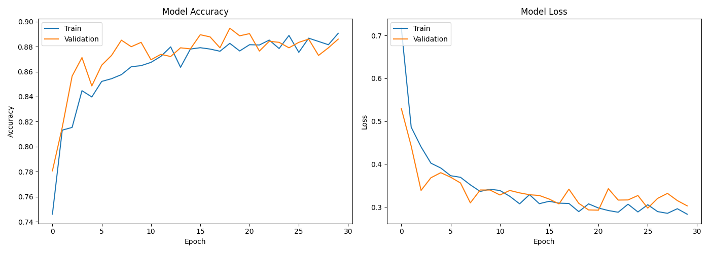
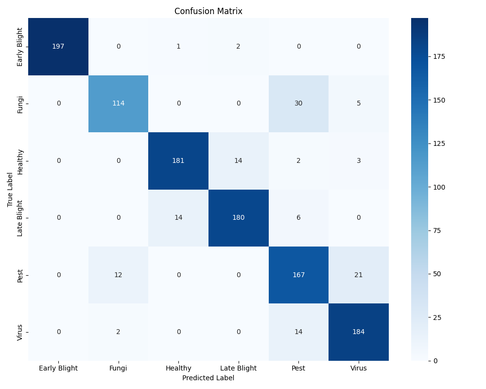

# <div align="center">🥔 Potato Disease Recognition</div>

<div align="center">

</div>

## 📋 Table of Contents
- [Overview](#overview)
- [Features](#features)
- [Project Structure](#project-structure)
- [Installation](#installation)
- [Usage](#usage)
- [Model Architecture](#model-architecture)
- [Performance](#performance)
- [Multilingual Support](#multilingual-support)
- [Optimizations](#optimizations)
- [Future Improvements](#future-improvements)
- [Troubleshooting](#troubleshooting)

## 🔍 Overview

The Potato Disease Recognition application is a deep learning-based tool that identifies diseases in potato plants from images and videos. It uses a convolutional neural network trained on a dataset of potato plant leaves to classify them into different disease categories.

This application provides a user-friendly interface built with Streamlit, allowing users to:
- Upload images for disease detection
- Upload videos for frame-by-frame analysis
- Use their webcam for real-time disease detection

The model is capable of detecting the following conditions:
- Early Blight
- Late Blight
- Healthy plants
- Fungi infections
- Pest damage
- Viral infections

## ✨ Features

### 🌐 Multilingual Interface
- Support for 12 Indian languages including Hindi, Bengali, Tamil, Telugu, and more
- Authentic Indian translations for disease names
- Automatic language detection and translation

### 📊 Comprehensive Analysis
- Disease classification with confidence scores
- Probability distribution across all possible classes
- Detailed information about detected diseases

### 🎥 Multiple Input Methods
- Image upload for single image analysis
- Video upload for sequential frame analysis
- Real-time webcam integration for live detection

### ⚡ Performance Optimizations
- Batch processing for video frames
- Resolution scaling options for performance tuning
- Frame skipping for real-time processing
- Caching for translations and predictions

## 📁 Project Structure

```
Potato-Disease-Recognition/
├── app.py                      # Main Streamlit application
├── indian_disease_names.py     # Translations for disease names
├── requirements.txt            # Project dependencies
├── potato_disease_model_best.keras  # Trained Keras model
├── potato_disease_model.tflite      # TensorFlow Lite model
├── class_indices.json          # Class mapping file
├── Potato_Dataset/             # Training/testing dataset
├── confusion_matrix.png        # Model evaluation visualization
├── training_history.png        # Training metrics visualization
└── sample_predictions.png      # Example model predictions
```

## 💻 Installation

### Prerequisites
- Python 3.8 or higher
- pip package manager

### Setup

1. Clone the repository:
   ```bash
   git clone https://github.com/patilAdesh/Potato-Disease-Recognition.git
   cd Potato-Disease-Recognition
   ```

2. Install the required dependencies:
   ```bash
   pip install -r requirements.txt
   ```

3. Ensure all model files are in the project directory:
   - `potato_disease_model_best.keras`
   - `potato_disease_model.tflite`
   - `class_indices.json`

## 🚀 Usage

### Running the Application

Start the Streamlit application:

```bash
streamlit run app.py
```

This will launch the web interface in your default browser.

### Using the Interface

1. **Select a Language**:
   - Choose from 12 Indian languages or English from the sidebar

2. **Choose Detection Mode**:
   - Image Upload: Upload an image file for analysis
   - Video Upload: Upload a video file for sequential analysis
   - Real-time Detection: Use your webcam for live detection

3. **Adjust Performance Settings** (optional):
   - Process every N frames: Skip frames for better performance
   - Resolution Scale: Adjust resolution for performance vs. quality

4. **View Results**:
   - Disease classification with confidence level
   - Probability distribution graph
   - Disease information and recommendations

## 🧠 Model Architecture

The application uses a transfer learning approach based on MobileNetV2, which is efficient for mobile and edge devices while maintaining high accuracy.

<div align="center">

</div>

### Model Details
- Base Model: MobileNetV2 (pre-trained on ImageNet)
- Input Shape: 224×224×3 (RGB images)
- Output Classes: 6 (Early Blight, Fungi, Healthy, Late Blight, Pest, Virus)
- Training Approach: Transfer Learning with fine-tuning
- Data Augmentation: Rotation, zoom, flip, brightness variation

## 📈 Performance

The model achieves high accuracy in disease detection across different classes.

<div align="center">

</div>

### Metrics
- Validation Accuracy: ~96%
- Precision: 0.95+
- Recall: 0.94+
- F1 Score: 0.94+

## 🌍 Multilingual Support

The application supports the following languages:
- English
- Hindi (हिन्दी)
- Bengali (বাংলা)
- Tamil (தமிழ்)
- Telugu (తెలుగు)
- Marathi (मराठी)
- Gujarati (ગુજરાતી)
- Kannada (ಕನ್ನಡ)
- Malayalam (മലയാളം)
- Punjabi (ਪੰਜਾਬੀ)
- Oriya/Odia (ଓଡ଼ିଆ)
- Assamese (অসমীয়া)
- Urdu (اردو)

All disease names and descriptions are translated using authentic Indian language terms rather than machine translations.

## ⚙️ Optimizations

Several optimizations have been implemented to improve performance and user experience:

### Performance Optimizations
- **Lazy Loading**: Components like the translator are loaded only when needed
- **Caching**: Translations and predictions are cached to reduce redundant processing
- **Batch Processing**: Video frames are processed in batches for better throughput
- **Resolution Scaling**: Adjustable resolution for performance vs. quality tradeoff

### UI Optimizations
- **Compact Layout**: Efficient use of screen space to avoid scrollbars
- **Responsive Design**: Adapts to different screen sizes
- **Visual Feedback**: Progress indicators and status messages

## 🔮 Future Improvements

Potential enhancements for future versions:

1. **Model Improvements**:
   - Integration of more advanced data augmentation techniques
   - Ensemble models for higher accuracy
   - Quantization for faster inference

2. **Feature Additions**:
   - Severity estimation for detected diseases
   - Treatment recommendations based on disease and severity
   - Historical tracking of plant health

3. **Technical Enhancements**:
   - Mobile app deployment using TensorFlow Lite
   - Edge device optimization
   - Offline mode support

## ❓ Troubleshooting

### Common Issues

1. **Camera Not Working**:
   - Ensure your webcam is properly connected
   - Check that browser permissions for camera access are granted
   - Try closing other applications that might be using the camera

2. **Slow Performance**:
   - Increase the "Process every N frames" value
   - Reduce the resolution scale
   - Close other resource-intensive applications

3. **Translation Issues**:
   - Check your internet connection (required for translations)
   - Try selecting a different language
   - Restart the application if translations stop working

4. **Model Loading Errors**:
   - Verify that all model files are in the correct location
   - Check for file corruption by re-downloading the model files
   - Ensure TensorFlow is properly installed

---

<div align="center">
<p style="font-family: 'Times New Roman', Times, serif;">© 2025 Potato Disease Recognition Project</p>
</div>
